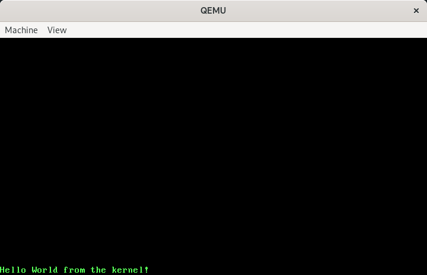

# AxolotlOS

A (very early-stage) 64-bit OS, for fun.

Comprised for now almost exclusively of a bootloader, which:

* Sets up the MBR
* Sets up a basic flat-model GDT
* Elevates from real mode to protected mode
* Sets up identity paging
* Elevates from protected mode to long mode
* Calls the `_start()` function in the kernel

## Ressources

* [Writing a Simple Operating System — from Scratch](https://www.cs.bham.ac.uk/~exr/lectures/opsys/10_11/lectures/os-dev.pdf): although it doesn't cover long mode, it has a lot of great information on computer architecture and covers well the 16-bit/32-bit parts of the bootloader.
* [Poncho's OS dev series](https://www.youtube.com/playlist?list=PLxN4E629pPnKKqYsNVXpmCza8l0Jb6l8-): great to actually see someone writing the code from scratch while explaining.
* [64-bit OS tutorial](https://github.com/gmarino2048/64bit-os-tutorial): the code is divided in chapters that incrementally build the bootloader, and goes beyond it to the kernel, with a much simpler build implementation than every other ressource I could find, using LLVM instead of cross-compiling GCC and writing a linker script.
* [OSDev wiki](https://wiki.osdev.org/Main_Page): tentacular and full of extensive articles about very specific topics that help getting those bits of info you can't find anywhere else.